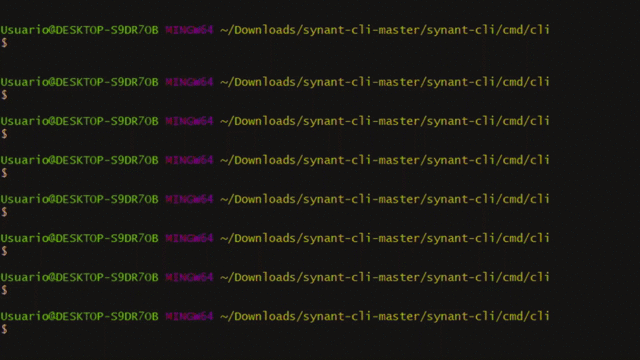

# synant-cli
A cli-command which provides antonyms and synonyms in spanish of the input.  
<b>Synant</b> shows the result on the screen and also generates a file in csv format with the antonyms or synonyms.  
 
 
&nbsp;&nbsp;&nbsp;&nbsp;&nbsp;&nbsp;&nbsp;&nbsp;&nbsp;&nbsp;
